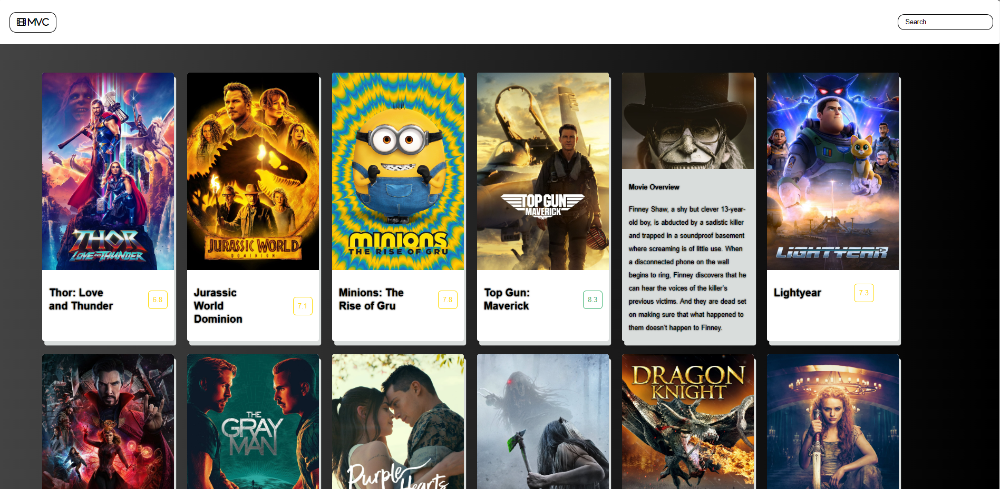

# MVC-Catalog 🎬

A project to create a nice template for a movie catalog website, each movie contains:

🔹 Her name

🔹 Overview of it

🔹 The score he recieved (the range is 0-10).



## Technologies

👉 HTML

👉 CSS

👉 JavaScript


1️⃣ I have added to the program 3 main methodes that will help me perform the task in a simpler way:

1. getMovies(url) - Function to initial movies according to the URL received.
2. showMovies(movies) - Function to show the movies on the screen.
3. getColorByRate(rate) - Function to get color by the movie's rate, the legality was determined as follows :

🔴 When the rating is a number below 5.

🟡 When the rating is a number in the range [5,8).

🟢 When the rating is a number in the range [8,10].

## External style libraries

🔹 Font Awesome

## Database I used

🔹 The Movie Database (TMDB)

## for any questions

```
if(haveAnyQuestions === true){
    let yourName = ".......", question = ".......";
    sendEmailToMe(yourName,question,odedatias8115@gmail.com);
}
```
